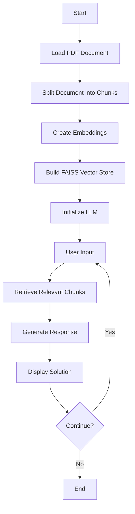

# Offline RAG Based Tech Support Chatbot

## Project Overview

This Python script builds a chatbot capable of providing tech support solutions based on a given PDF document. It leverages Retrieval-Augmented Generation (RAG) techniques to provide accurate and context-aware responses.

## Workflow



## Key Features

* Loads and splits a PDF document into chunks
* Creates embeddings for each chunk using Hugging Face Transformers
* Builds a FAISS vector store for efficient search
* Utilizes a custom prompt to guide the LLM
* Provides a conversational interface for user interaction
* Offers solutions based on the provided product, issue type, and specific issue

## Prerequisites

* Python 3.6+
* Required libraries:
  ```bash
  pip install langchain langchain_community sentence-transformers faiss ollama
  ```
* A local Ollama model (e.g., qwen:0.5b)
* A PDF document containing tech support information

## Usage

1. Replace `'Fixed.pdf'` with the path to your PDF file in the script.
2. Ensure you have a local Ollama model configured.
3. Run the Python script:
   ```bash
   python tech_support_chatbot.py
   ```
4. Follow the prompts to enter product, issue type, and issue.
5. The chatbot will provide a solution based on the given information.

## How it Works

1. Loads the PDF document and splits it into chunks.
2. Creates embeddings for each chunk using Hugging Face's all-MiniLM-L6-v2 model.
3. Builds a FAISS vector store to efficiently retrieve relevant chunks based on user input.
4. Defines a custom prompt to guide the LLM in providing solutions.
5. Uses the Ollama language model to generate responses based on the retrieved information.

## Limitations

* Relies on the quality of the PDF content.
* The chatbot's performance depends on the chosen language model and embedding model.
* The current implementation is a basic prototype and may require improvements for production use.

## Potential Improvements

* Implement error handling and logging.
* Enhance the chatbot's conversational abilities.
* Explore different language models and embedding models.
* Add features like FAQ handling or troubleshooting steps.

## Additional Notes

* Consider using a more robust vector store for larger datasets.
* Experiment with different prompt engineering techniques to improve response quality.
* Evaluate the performance of different language models for your specific use case.

## Contributing

Contributions are welcome! Please feel free to submit a Pull Request.

## License

This project is licensed under the [MIT License](LICENSE).
